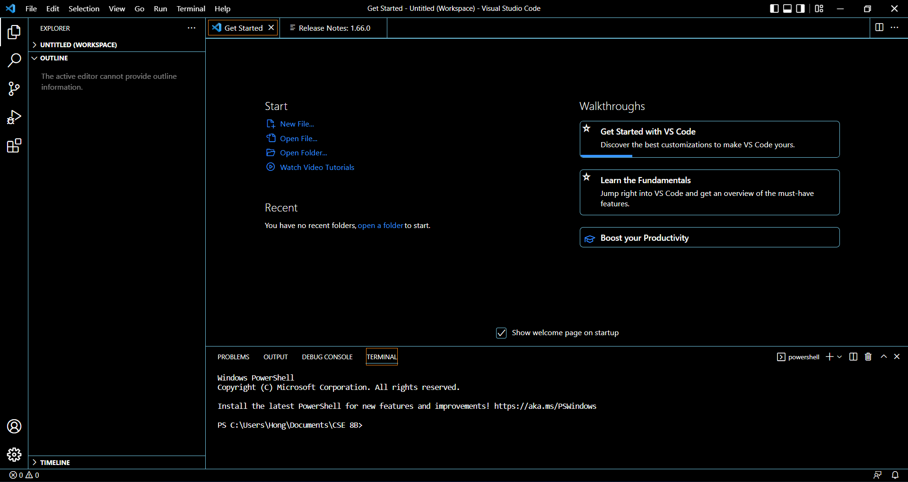
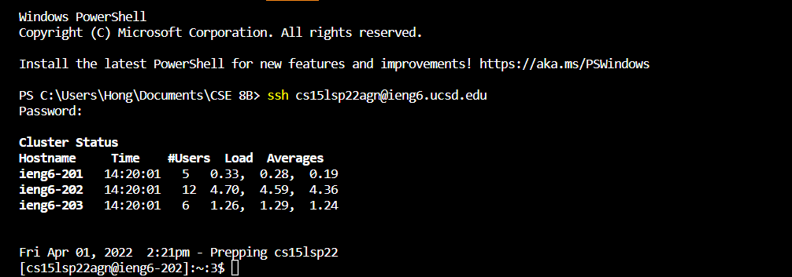
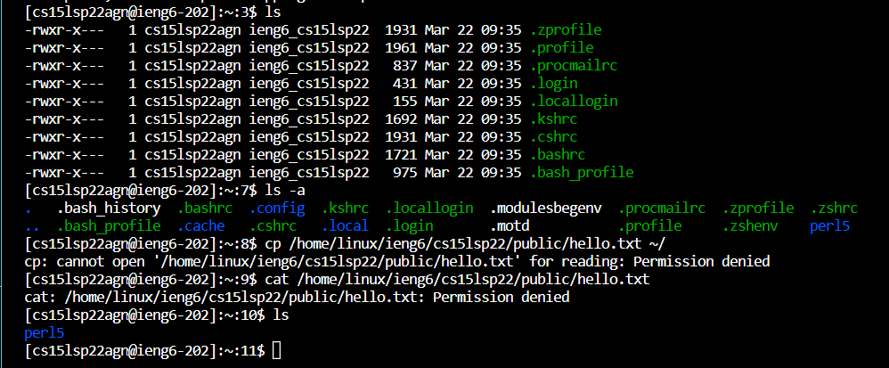
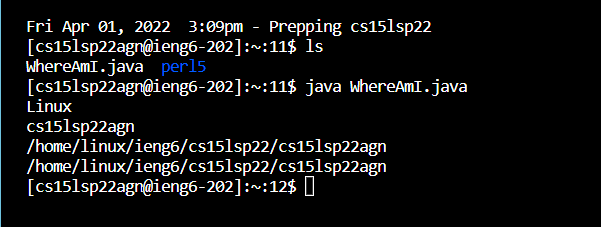
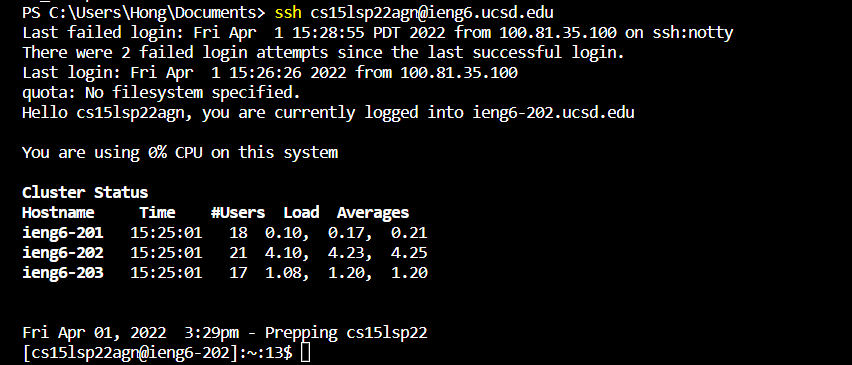
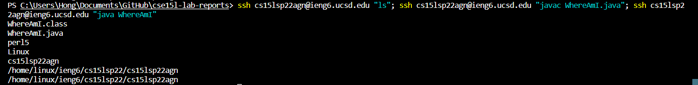

> # Lab Report 1 

 1. **Installing Vscode** 
    - Download [Visual Studio Code](https://code.visualstudio.com/) using the link inserted
    - Open and run the file, finishing the setup
    - Launch Vscode

  

 2. **Remotely Connecting**  
    - Check whether OpenSSH is installed, if not install the program
    - Open a new terminal in Vscode
    - Type in ssh followed by accountname@ieng6.ucsd.edu and input account password

   

 3. **Trying Some Commands**
    - Type different commands to test what they do
    - For example: cd: change directory, ls: list, pwd: prints current directory, mkdir: make directory, cp: copy, cat: concatenate or view file content
    - To exit, type the command "Ctrl+D"

 

 4. **Moving Files with scp**
    - Create a file (for example: WhereAmI.java) in order for us to copy and move; make sure you are on the client, not the server
    - Use the command scp followed by the file name followed by the directory you want to move and copy to (If prompted for a password, enter your password)
    - Log into server to check if successful using the command "ls"  

 If successful, a similar screen should be shown:
 

 5. **Setting an SSH Key**
    - Type in the command "ssh-keygen"; when prompted to type in a file to save key, retype the same file directory that appeared, then press enter twice when asked for passphrase (this makes sure there's no password). A file directory will be shown where your public key has been saved in, this directory will be needed.
    - If on windows, follow the [extra steps](https://docs.microsoft.com/en-us/windows-server/administration/openssh/openssh_keymanagement#user-key-generation) in the link
    - Log into the server and type "mkdir .ssh" to make a new directory. Copy the public key to .ssh directory by logging out of the server and typing in the command "scp" followed by the directory your public key is saved in, this can be seen in the first step or "/Users/user-name/.ssh/id_rsa.pub" (make sure to change username to client username) followed by "accountname@ieng6.ucsd.edu:~/.ssh/authorized_keys"    

 Test ssh login, if successful no password is needed as shown:
   

 6. **Optimizing Remote Running**
    - Type in login ifo as usual, "ssh user@ieng6..." and add in extra step using quotation marks
    - Use semi-colons to run multiple commands, if utilizing server add ssh user... every new extra command
    - Optional: Use the up-arrow to use your last command

 Example of optimization:
 
