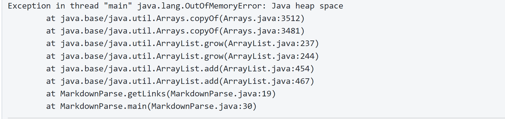

> # Lab Report 2

 1. **Code Change 1**
    - Screenshot of first code change:
        

    - [Link to first test file with failure inducing input](Markdown.md)

    - Failure Output When Running:
        

    - The test file had [] at the end of the code which lead to a failure inducing output with the symptom being Java heap space. The original MarkdownParse caused a bug where the program kept looping since there were no parenthesis to read from which lead to this Java heap symptom.

 2. **Code Change 2**
    - Screenshot of second code change:  
    (The same change solved both the first test failure and the second test failure, hence same screenshot)
        

    - [Link to second test file with failure inducing input](test2.md)

    - Failure Ouput when Running:
         

    - The symptom is the same as the first test where we get a Java heap space as an error due to the programming looping multiple times due to a bug. This becuase there's an empty line after the final ].

 3. **Code Change 3**
    - Screenshot of third code change:  
        

    - [Link to thirds test file with failure inducing input](Test3.md)  

    - Failure Output When Running:  
        

    - The original program doesn't differentiate between actual links and images which are very similar to each other in format. The bug was that the program read what's inside the parenthesis of the image when it's supposed to read only that of the links. Therefore the symptom is that the output contains another "link" that it shouldn't contain.
