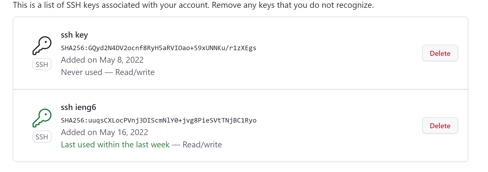
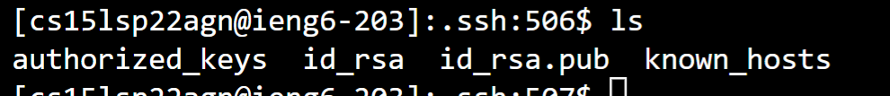
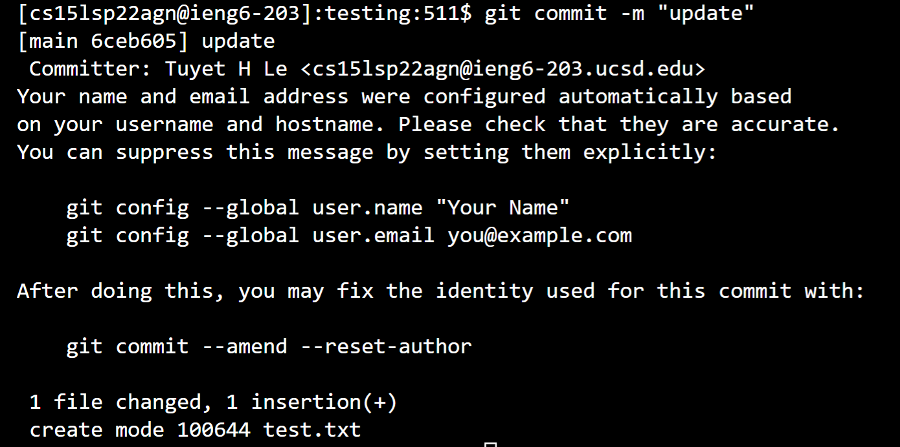
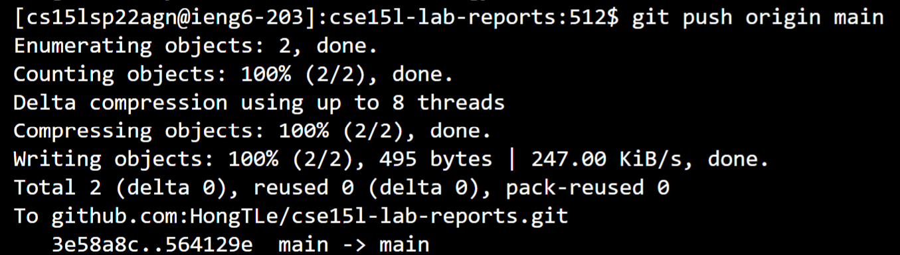

> # Lab Report 3

 1. **Streamlining ssh Configuration**  
    * .ssh/config file edited using VScode  
    
    * ssh command login  
    
    * scp command to copy file  
    

 2. **Setup Github Access from ieng6**  
    * public key on Github
    
    * public and private key in user account
    
    * git commit
    
    * git push
    
    * [Resulting Commit Link](https://github.com/HongTLe/testing/commit/6ceb605d2ae6e8b4f384bffc6ca0daaa97232b60)
 3. ** 