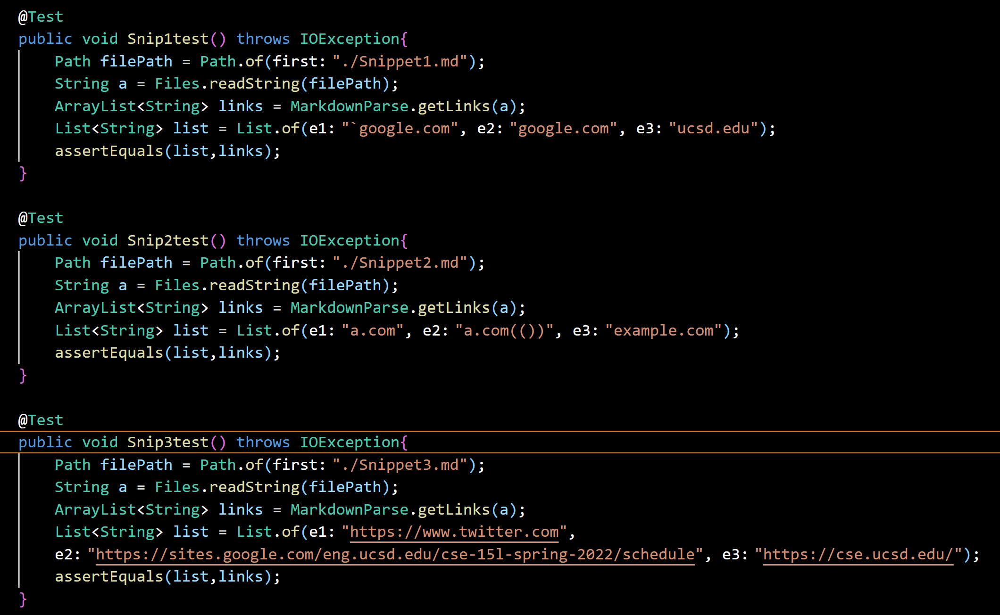
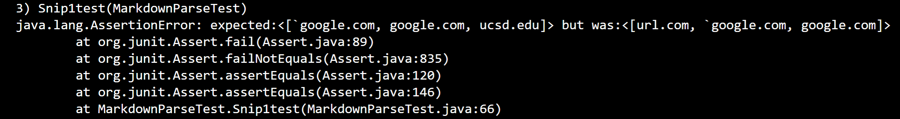
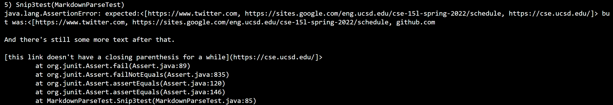
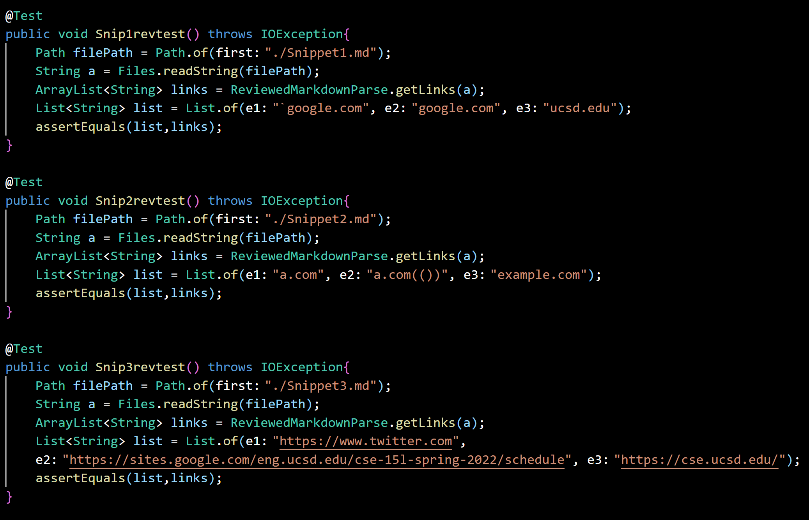
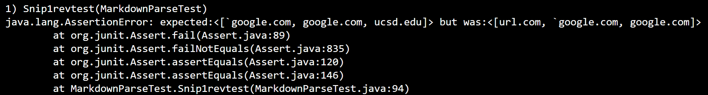
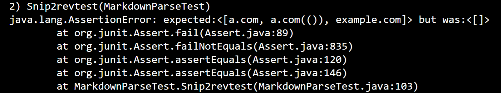
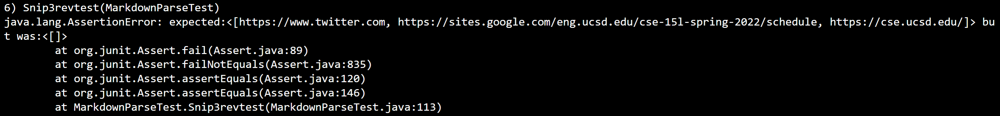

> # Lab Report 4

 [My markdown parser](https://github.com/HongTLe/markdown-parser.git)  
 [Reviewed markdown parser](https://github.com/anhthony/markdown-parser.git)  
 
 **Expected Outcome**  
 Snippet 1: `google.com, google.com, ucsd.edu  
 Snippet 2: a.com, a.com(()), example.com  
 Snippet 3: https://www.twitter.com, https://sites.google.com/eng.ucsd.edu/cse-15l-spring-2022/schedule, https://cse.ucsd.edu/

 **My Implementation**  
 Tests:
 
 Snippet 1: Failed  
   
 Snippet 2: Failed  
   
 Snippet 3: Failed  
   

 **Markdown Parser Reviewed Implementation**  
 Tests:
  
 Snippet 1: Failed  
   
 Snippet 2: Failed  
   
 Snippet 3: Failed  
    
 
