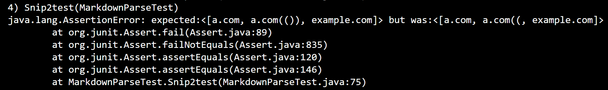

> # Lab Report 4

 [My markdown parser](https://github.com/HongTLe/markdown-parser.git)  
 [Reviewed markdown parser](https://github.com/anhthony/markdown-parser.git)  
 
 **Expected Outcome**  
 Snippet 1: `google.com, google.com, ucsd.edu  
 Snippet 2: a.com, a.com(()), example.com  
 Snippet 3: https://www.twitter.com, https://sites.google.com/eng.ucsd.edu/cse-15l-spring-2022/schedule, https://cse.ucsd.edu/

 **My Implementation**  
 Tests:
 
 Snippet 1: Failed  
   
 Snippet 2: Failed  
   
 Snippet 3: Failed  
   

 **Markdown Parser Reviewed Implementation**  
 Tests:
  
 Snippet 1: Failed  
   
 Snippet 2: Failed  
   
 Snippet 3: Failed  
    

 **Code Changes**  
 1. Only a small code change is needed for snippet 1 to work. An if statement is needed to check inline code with backticks. If there's a backtick inside brackets then it doesn't count as a link but if there's a backtick inside the parenthesis, then the link will contain a backtick.
 2. Only a small code change is needed for snippet 2 to work. The code to find the end parenthesis should be modified since the end parenthesis didn't appear in the link found.
 3. Snippet 3 also needs a small code change. Once again the code to find end parenthesis needs to be adjusted because one of the links that was found was the one that didn't have an end parenthesis in the format and the third link that has a long space before the closing parenthesis should still return a link.
 
