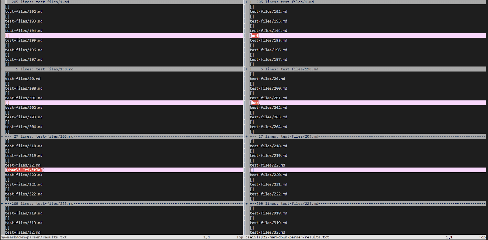

> # Lab Report 5

 1. **How Found**
    - Vimdiff was used on both markdown parser bash results to compare the differences.  
 2. **Test-file links that provided different results (From provided repository)** 
    - [Test-file 194](https://github.com/nidhidhamnani/markdown-parser/blob/main/test-files/194.md)
    - [Test-file 201](https://github.com/nidhidhamnani/markdown-parser/blob/main/test-files/201.md)
 3. **Accuracy**  
    - 

