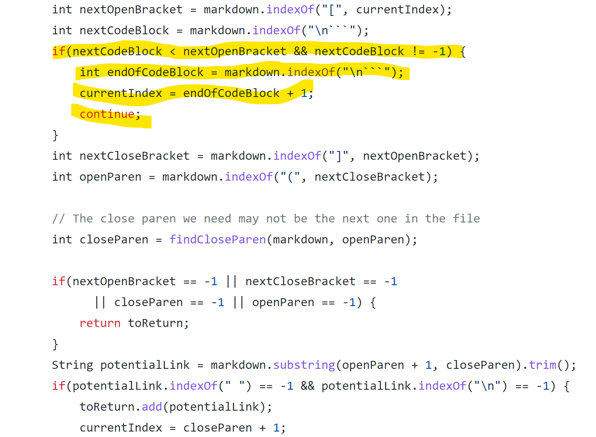

> # Lab Report 5

 1. **How Found**
    - Vimdiff was used on both markdown parser bash results to compare the differences.  
 2. **Test-file links that provided different results (From provided repository)** 
    - [Test-file 194](https://github.com/nidhidhamnani/markdown-parser/blob/main/test-files/194.md)
    - [Test-file 201](https://github.com/nidhidhamnani/markdown-parser/blob/main/test-files/201.md)
 3. **Accuracy**  
    - 
    - For test file 194.md:  
      My output: []  
      Other output: [url]  
      Expected output: []
    - For test file 201.md:  
      My output: []  
      Other output: [baz]  
      Expected output: []
    - For both tests, the result of my-mark-down-parser was correct instead of the provided repository
    -   
        - The bug is that the code considers everything inside the first pair of parenthesis as a url, even if the format is not correct, therefore it shouldn't be counted as a url. For example: [url]phfa(url.com). url.com would be returned even though it is not formatted correctly and is not a url.

